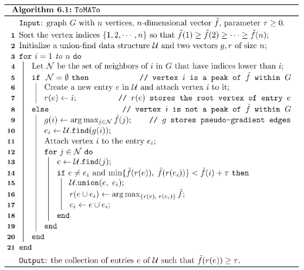

# ClusteringToMATo.jl

Julia package, based on 

Chazal, F., Guibas, L. J., Oudot, S. Y., and Skraba, P. 2013. Persistence-based clustering in Riemannian
manifolds.
J. ACM
60, 6, Article 41 (November 2013), 38 pages.
DOI:
http://dx.doi.org/10.1145/2535927
([pdf](https://geometrica.saclay.inria.fr/data/Steve.Oudot/clustering/jacm_oudot.pdf))

You can find more details on this algorithm and the C++ implementation [here](@ref original_cpp).

## Algorithm ToMATo



This algorithm is implemented in [`compute_persistence`](@ref)

## Create some data

```@example first
using ClusteringToMATo
using Plots
using Random

rng = MersenneTwister(123)
points, labels = noisy_circles(rng, 1000)
scatter(points[1,:], points[2,:], c = labels, aspect_ratio=1)
```

## Density estimator

Several are available: [`BallDensity`](@ref), [`KNNDensity`](@ref), [`GaussianNN`](@ref),
[`GaussianCutoff`](@ref), [`DTM`](@ref).
Each of these estimators uses one or two parameters.

```@example first
f = compute_density(DTM(20), points)
scatter(points[1,:], points[2,:], marker_z = f, aspect_ratio=1, markerstrokewidth=0)
```

## Neighborhood graph

ToMATo relies on the neighborhood information encoded in the input graph. Two options are available:

- [`BallGraph`](@ref) connects two data points when they lie within distance δ of each other. 
  Different choices of ``\delta`` may reveal different structures. This
  is why we recommend running ToMATo at several scales. For too large values
  of δ there will be no real structure in the persistence diagram, while too small
  values will produce too many infinitely prominent peaks in the
  persistence diagram, corresponding to the connected components of the graph.

- [`KNNGraph`](@ref) the k-nearest neighbor graph. You get correct clusters under a suitable 
  choice of parameter k accomplished by trial-and-error.

```@example first
graph = compute_graph(BallGraph(0.2), points)
```
## Merging parameter 

τ determines which peaks of f are considered significant.  To choose
it, call the function with τ set to `Inf`, and plot the persistence
diagram. It reveals the topological structure of f, providing the
height and prominence of each peak of f. In cases where the persistence
diagram of f shows a large gap separating a small set of k highly
prominent peaks from the rest of the structure, we infer that the
number of clusters is likely to be `k`, and so you can set τ to be
any value between the prominences of the `k` distinguished peaks and
the prominences of the rest of the persistence diagram.  By default,
we try to detect the gap automatically. we sort the points in the
persistence diagram by decreasing prominence, and then we look for
the largest drop in the sequence of prominences.


```@example first
labels, intervals = compute_persistence(f, graph, Inf)

plot(intervals)
```

```@example first
labels, intervals = compute_persistence(f, graph, 15)
scatter(points[1,:], points[2,:], c = labels, aspect_ratio=1)
```

[`tomato`](@ref) takes in the data points and three inputs: the neighborhood graph type, the density
estimator type, and the merging parameter τ. 

```@example first
labels, intervals = tomato(points, BallGraph(0.2) , DTM(20), 15)
scatter(points[1,:], points[2,:], c = labels, aspect_ratio=1)
```

## Functions

```@autodocs
Modules = [ClusteringToMATo]
Order   = [:function]
```

## Types

```@autodocs
Modules = [ClusteringToMATo]
Order   = [:type]
```
